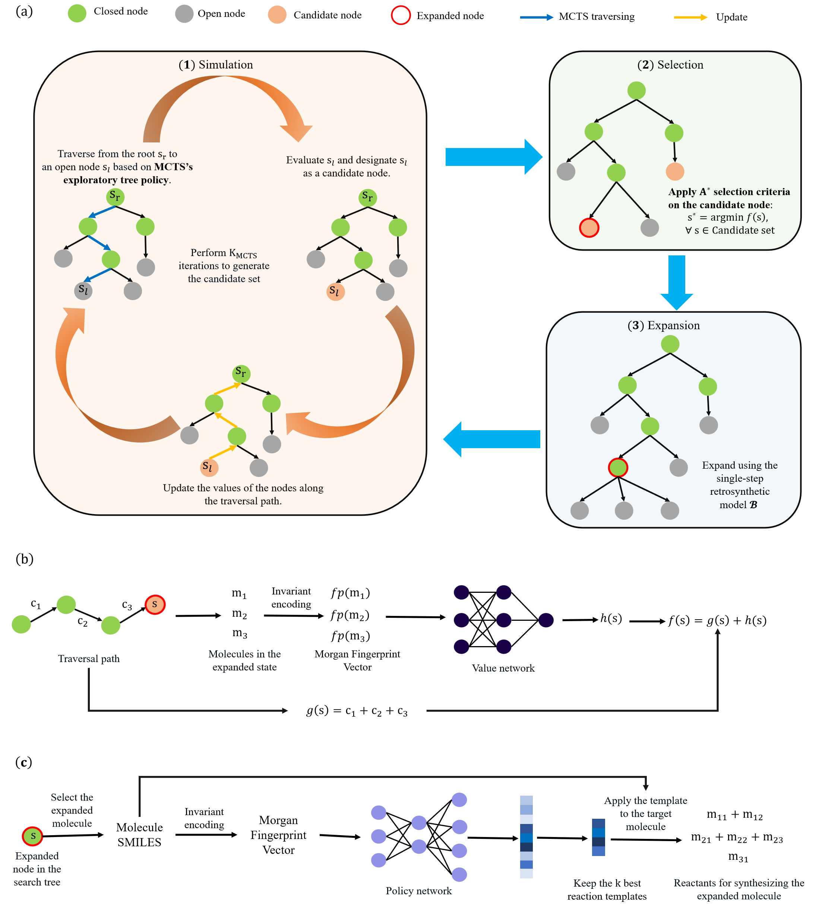

# Efficient retrosynthetic planning with MCTS exploration enhanced A* search

This is open-source codebase for MEEA*-PC (https://www.nature.com/articles/s42004-024-01133-2). MEEA* is proposed to incorporate the exploratory behavior of MCTS into A* by providing a look-ahead search. Path consistency is adopted as a regularization to improve the generalization performance of heuristics. Details about the search algorithm is summarized in the following figure.


Extensive experimental results on $10$ molecule datasets demonstrate the effectiveness of MEEA*. Moreover, for natural products, MEEA*-PC successfully identifies bio-retrosynthetic pathways for $97.68\%$ test compounds. Experiment results on each dataset is summarized in the following table:
|Dataset|Success Rate|Dataset|Success Rate|
|:-:|:-:|:-:|:-:|
|USPTO|$94.74\%$|logS|$80.34\%$|
|BBBP|$66.88\%$|ClinTox|$60.51\%$|
|logP|$73.72\%$|DPP4|$96.04\%$|
|BACE|$56.32\%$|Ames|$78.74\%$|
|Toxicity LD50|$72.94\%$|SVS|$73.01\%$|

## Requirements
rdkit==2022.9.3 

torch==1.13.1 

pandas==1.3.5

numpy==1.21.5

tqdm==4.64.1

rdchiral needs to be installed by
```
pip install -e rdchiral
```

## Testing
Download the building block molecules, and pretrained models from
<https://drive.google.com/file/d/1lXtRKRGETEYz0bTRAsl1LsBYGD20MM9O/view?usp=drive_link>

To test on regular organic molecule datasets
```
python MEEA_PC_parallel.py
```
To test on natural products
```
python MEEA_PC_NPs_parallel.py
```
## Citation
If you find this repo useful, please cite our paper:
```
@article{zhao2024efficient,
  title={Efficient retrosynthetic planning with MCTS exploration enhanced A* search},
  author={Zhao, Dengwei and Tu, Shikui and Xu, Lei},
  journal={Communications Chemistry},
  volume={7},
  number={1},
  pages={52},
  year={2024},
  publisher={Nature Publishing Group UK London}
}
```
## Acknowledgement

We appreciate the following github repos greatly for their valuable code base implementations:

<https://github.com/binghong-ml/retro_star>

<https://github.com/junsu-kim97/self_improved_retro>

<https://github.com/prokia/BioNavi-NP>
